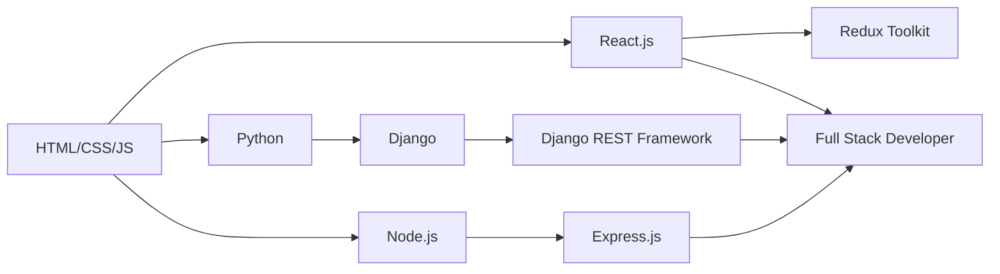

<h1 align="center">Hi 👋, I'm Aryan Kaushik</h1>
<h3 align="center">Full Stack Developer | React • Django • Node.js | Building Scalable Web Applications</h3>

<p align="center">
  
  
</p>

---

## 🚀 About Me

- 🔭 Currently working on **Full Stack E-Commerce Platforms** with React & Django
- 🌱 Exploring **Advanced React Patterns, Redux Toolkit, and Django REST Framework**
- 💼 Open to **Full Stack Developer** opportunities
- 💬 Ask me about **React, Django, Node.js, MongoDB, REST APIs**
- 📫 Reach me at **aryankaushik541@gmail.com**
- ⚡ Fun fact: **I turn coffee into code ☕️**

---

## 🛠️ Tech Stack

### Frontend


### Backend


### Database


### Tools & Others


---

## 📊 GitHub Stats


## 🏆 GitHub Trophies

<p align="center">
  
</p>

---

## 💼 Featured Projects

### 🛒 [Neverend Lifestyle - Full Stack E-Commerce](https://github.com/Aryankaushik541/Website)
**Tech Stack:** React, Vite, Redux Toolkit, Django REST Framework, JWT, Firebase, Tailwind CSS, Material-UI

A complete lifestyle brand e-commerce platform with advanced features:
- JWT authentication with Firebase integration
- Redux Toolkit state management
- Material-UI & Tailwind CSS responsive design
- Django REST API backend with CORS support
- Google reCAPTCHA security
- Framer Motion animations

[](https://github.com/Aryankaushik541/Website)

---

### 🛍️ [Modern E-Commerce Platform](https://github.com/Aryankaushik541/ecommerce-react-frontend)
**Tech Stack:** React, React Router, Axios, Framer Motion

Modern e-commerce frontend with creative themes and smooth transitions:
- Dynamic background transitions
- Admin panel for product management
- Responsive design with smooth animations
- Shopping cart functionality

[](https://github.com/Aryankaushik541/ecommerce-react-frontend)
[](https://github.com/Aryankaushik541/ecommerce-django-backend)

---

### 👥 [User Management System - PurpleMerit Assessment](https://github.com/Aryankaushik541/user-management-system-purplemerit)
**Tech Stack:** Node.js, Express, MongoDB, React, JWT, RBAC

Full-stack user management system with role-based access control:
- JWT authentication & authorization
- Role-Based Access Control (Admin, Manager, User)
- RESTful API with Express.js
- MongoDB database with Mongoose ODM
- React frontend with modern UI

[](https://github.com/Aryankaushik541/user-management-system-purplemerit)

---

### 👕 [T-Shirt Store - Full Stack](https://github.com/Aryankaushik541/tshirt-store-frontend)
**Tech Stack:** React, Django REST Framework, Payment Integration

Complete e-commerce solution for T-shirt store:
- Product catalog with filtering
- Shopping cart & checkout
- Payment gateway integration
- Order management system

[](https://github.com/Aryankaushik541/tshirt-store-frontend)
[](https://github.com/Aryankaushik541/tshirt-store-backend)

---

## 📈 Contribution Graph

<p align="center">
  
</p>

<p align="center">
  
  
</p>

<p align="center">
  
  
</p>

---

## 🎯 Key Achievements

- ✅ Built **4+ Full Stack E-Commerce Applications** with React & Django
- ✅ Implemented **JWT Authentication & RBAC** in production applications
- ✅ Integrated **Payment Gateways** and **Firebase** services
- ✅ Developed **RESTful APIs** with Django REST Framework & Express.js
- ✅ Created **Responsive UIs** with Material-UI, Tailwind CSS, and Framer Motion
- ✅ Managed **State** with Redux Toolkit and Context API
- ✅ Worked with **MongoDB, PostgreSQL, and SQLite** databases

---

## 📫 Connect With Me

<p align="center">
  <a href="mailto:aryankaushik541@gmail.com">
    
  </a>
  <a href="https://github.com/Aryankaushik541">
    
  </a>
  <a href="https://linkedin.com/in/aryan-kaushik" target="_blank">
    
  </a>
</p>

---

## 💡 What I Bring to the Table

```javascript
const aryanKaushik = {
    role: "Full Stack Developer",
    code: ["JavaScript", "Python", "HTML", "CSS"],
    technologies: {
        frontend: {
            js: ["React", "Redux Toolkit", "Vite"],
            css: ["Tailwind CSS", "Material-UI", "Framer Motion"]
        },
        backend: {
            python: ["Django", "Django REST Framework"],
            js: ["Node.js", "Express.js"]
        },
        databases: ["MongoDB", "PostgreSQL", "MySQL", "SQLite"],
        tools: ["Git", "GitHub", "Postman", "Firebase"]
    },
    architecture: ["REST APIs", "JWT Authentication", "RBAC", "MVC"],
    currentFocus: "Building scalable full-stack applications",
    funFact: "I debug with console.log and I'm not ashamed! 😄"
};
```

---

## 🎓 Learning Journey



---

<p align="center">
  
</p>

<p align="center">
  <i>⭐️ From <a href="https://github.com/Aryankaushik541">Aryan Kaushik</a> - Let's build something amazing together!</i>
</p>
