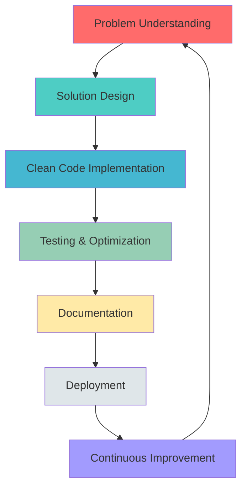
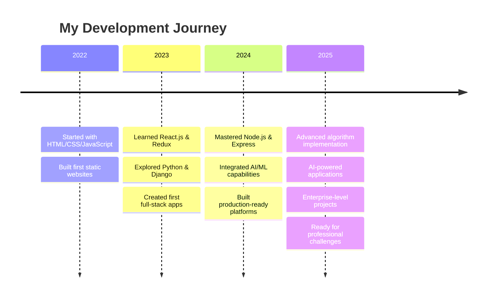

<div align="center">

# 👋 Hi, I'm Aryan Kaushik

### 🚀 Full Stack Developer | AI Enthusiast | Problem Solver

[](https://github.com/Aryankaushik541)
[](https://github.com/Aryankaushik541)
[](mailto:aryankaushik541@gmail.com)

</div>

---

## 🎯 About Me

```typescript
const aryanKaushik = {
    title: "Full Stack Developer",
    location: "India 🇮🇳",
    currentFocus: "Building AI-powered web applications",
    expertise: ["React.js", "Django", "Node.js", "AI Integration", "Algorithm Design"],
    passion: "Transforming ideas into scalable, production-ready solutions",
    availability: "Open to Full-Time Opportunities & Freelance Projects",
    motto: "Code with purpose, build with passion ⚡"
};
```

- 🔭 **Currently Working On:** AI-powered platforms and genetic algorithms
- 🌱 **Learning:** Advanced AI/ML integration, System Design, Cloud Architecture
- 💼 **Looking For:** Full Stack Developer / Software Engineer roles
- 💡 **Interests:** Artificial Intelligence, Web Development, Algorithm Optimization
- 📫 **Reach Me:** aryankaushik541@gmail.com

---

## 🛠️ Tech Arsenal

<div align="center">

### Frontend Development


### Backend Development


### Database & Cloud


### AI & Tools


</div>

---

## 🌟 Featured Projects

### 🤖 [White Beat AI Platform](https://github.com/Aryankaushik541/white-beat-frontend)
**AI-Powered Content Generation Platform**

<div align="left">

**Tech Stack:** React • Django • OpenAI API • JWT Authentication • Material-UI

**Key Features:**
- 🎨 AI-powered content generation using OpenAI GPT models
- 👥 Dual dashboard system (User & Admin)
- 🔐 Secure JWT authentication with role-based access
- 📊 Real-time analytics and usage tracking
- 🎯 Modern, responsive UI with Material-UI components

**Impact:** Built a production-ready AI platform enabling users to generate high-quality content with advanced AI models

[](https://github.com/Aryankaushik541/white-beat-frontend)
[](https://github.com/Aryankaushik541/white-beat-backend)

</div>

---

### 🧬 [Genetic Algorithm Optimizer](https://github.com/Aryankaushik541/Genetic-Algorithm)
**Advanced Optimization Using Evolutionary Computing**

<div align="left">

**Tech Stack:** Python • NumPy • Matplotlib • Algorithm Design

**Key Features:**
- 🔬 Implementation of genetic algorithm for optimization problems
- 📈 Visualization of evolution and convergence
- ⚡ Efficient population management and selection strategies
- 🎯 Customizable fitness functions and genetic operators

**Impact:** Demonstrated strong understanding of computational intelligence and algorithm optimization

[](https://github.com/Aryankaushik541/Genetic-Algorithm)

</div>

---

### 👥 [User Management System - PurpleMerit Assessment](https://github.com/Aryankaushik541/user-management-system-purplemerit)
**Enterprise-Grade User Management with RBAC**

<div align="left">

**Tech Stack:** Node.js • Express • MongoDB • React • JWT • RBAC

**Key Features:**
- 🔐 Complete authentication & authorization system
- 👔 Role-Based Access Control (Admin, Manager, User)
- 🎨 Modern React frontend with intuitive UI
- 📡 RESTful API with comprehensive error handling
- 🗄️ MongoDB with Mongoose ODM for data persistence

**Impact:** Successfully completed technical assessment demonstrating full-stack expertise

[](https://github.com/Aryankaushik541/user-management-system-purplemerit)

</div>

---

### 🛒 [Neverend Lifestyle - E-Commerce Platform](https://github.com/Aryankaushik541/Website)
**Full-Featured Lifestyle Brand E-Commerce**

<div align="left">

**Tech Stack:** React • Redux Toolkit • Django REST • Firebase • Tailwind CSS

**Key Features:**
- 🛍️ Complete e-commerce functionality (cart, checkout, orders)
- 🔒 Firebase authentication with JWT integration
- 🎨 Beautiful UI with Tailwind CSS & Material-UI
- 📱 Fully responsive design with smooth animations
- 🔐 Google reCAPTCHA security integration

**Impact:** Built a production-ready e-commerce platform with modern tech stack

[](https://github.com/Aryankaushik541/Website)

</div>

---

### 🎨 [Modern E-Commerce Platform](https://github.com/Aryankaushik541/ecommerce-react-frontend)
**Creative E-Commerce with Admin Panel**

<div align="left">

**Tech Stack:** React • Django REST • Framer Motion • Axios

**Key Features:**
- 🎭 Dynamic background transitions and animations
- 👨‍💼 Complete admin panel for product management
- 🛒 Shopping cart with real-time updates
- 📦 Product catalog with filtering and search

[](https://github.com/Aryankaushik541/ecommerce-react-frontend)
[](https://github.com/Aryankaushik541/ecommerce-django-backend)

</div>

---

## 📊 GitHub Analytics

<div align="center">


</div>

---

## 🏆 Key Achievements & Skills

<div align="center">

| 🎯 Achievement | 📝 Description |
|:---|:---|
| **AI Integration** | Built production AI platform with OpenAI API integration |
| **Full Stack Mastery** | Developed 5+ complete full-stack applications |
| **Algorithm Design** | Implemented genetic algorithms and optimization techniques |
| **Authentication Expert** | JWT, RBAC, Firebase Auth in multiple projects |
| **Modern UI/UX** | Material-UI, Tailwind CSS, Framer Motion animations |
| **API Development** | RESTful APIs with Django REST Framework & Express.js |
| **Database Management** | MongoDB, PostgreSQL, MySQL, SQLite |
| **State Management** | Redux Toolkit, Context API, React Query |
| **Payment Integration** | Integrated payment gateways in e-commerce platforms |
| **Responsive Design** | Mobile-first, cross-browser compatible applications |

</div>

---

## 💼 What I Bring to Your Team

```python
class AryanKaushik:
    def __init__(self):
        self.role = "Full Stack Developer"
        self.experience = {
            "frontend": ["React", "Redux", "TypeScript", "Modern UI Libraries"],
            "backend": ["Django", "Node.js", "Express", "REST APIs"],
            "ai_ml": ["OpenAI Integration", "Genetic Algorithms", "AI-powered Apps"],
            "databases": ["MongoDB", "PostgreSQL", "MySQL"],
            "tools": ["Git", "GitHub", "Postman", "Firebase"]
        }
        
    def strengths(self):
        return [
            "🚀 Quick learner with strong problem-solving skills",
            "💡 Ability to translate business requirements into technical solutions",
            "🤝 Excellent team collaboration and communication",
            "📚 Self-motivated with continuous learning mindset",
            "⚡ Delivers clean, maintainable, and scalable code",
            "🎯 Focus on user experience and performance optimization"
        ]
    
    def current_goal(self):
        return "Seeking opportunities to build impactful products with cutting-edge technologies"

# Ready to contribute from Day 1! 🚀
developer = AryanKaushik()
print(developer.strengths())
```

---

## 📈 Development Philosophy

<div align="center">



</div>

---

## 🎓 Technical Journey

<div align="center">



</div>

---

## 📫 Let's Connect!

<div align="center">

[](mailto:aryankaushik541@gmail.com)
[](https://github.com/Aryankaushik541)
[](https://linkedin.com/in/aryan-kaushik)

### 💬 Open to Discuss

- 💼 Full-time opportunities
- 🚀 Freelance projects
- 🤝 Open source collaborations
- 💡 Tech discussions and knowledge sharing

</div>

---

<div align="center">

### 🌟 "Building the future, one commit at a time" 🌟


**⭐ If you find my work interesting, consider starring my repositories!**

*Last Updated: January 2025*

</div>
